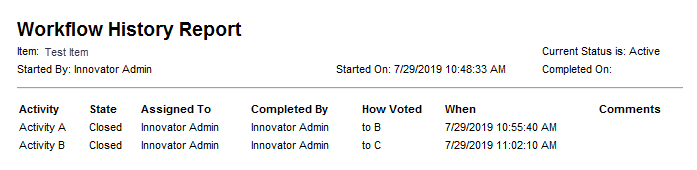

# Workflow Report Email

The Workflow Report Email project adds a Workflow Report Method and an Email template to allow this report to be attached to a server event such as a workflow assignment.

_A sample email generated by the project_

#### How it works
This project adds an email template to run a workflow report method to get the current input item id and the attached workflow and then output the resulting report into an email. It is used by attaching that email template to a workflow activity that will then send the email at the specified trigger. This requires Aras Innovator to be setup to send emails and the *from account* listed on the email template to have a valid email address. 

>Note: The default report settings will only display closed items and will not cycle through subflows. (Example: the above screenshot is sitting at Activity C; if the email were sent from activity A, the email would only display the header with no information.) The report settings can be changed by altering the method code.

## History

Release | Notes
--------|--------
[v1.0.0](https://github.com/ArasLabs/workflow-email-report/releases/tag/v1.0.0) | First release 

#### Supported Aras Versions

Project | Aras
--------|------
[v1.0.0](https://github.com/ArasLabs/workflow-email-report/releases/tag/v1.0.0) | 11.0+, 12.0+ 

## Installation

#### Important!
**Always back up your code tree and database before applying an import package or code tree patch!**

### Pre-requisites

1. Aras Innovator installed
2. Aras Package Import tool
3. Workflow Report Email import package
4. The target Aras instance must have an SMTP server configured. See Testing Options below for testing the project without a full SMTP server configured.
5. Users must have email addresses in the target Aras database. 

### Install Steps

1. Backup your database and store the BAK file in a safe place.
2. Open up the Aras Package Import tool.
3. Enter your login credentials and click **Login**
     * _Note: You must login as root for the package import to succeed!_
4. Enter the package name in the TargetRelease field.
     * Optional: Enter a description in the Description field.
5. Enter the path to your local `..\Workflow-Report-Email\Imports\imports.mf` file in the Manifest File field.
6. Select **aras.labs.WorkflowReportEmail** in the Available for Import field.
7. Select Type = **Merge** and Mode = **Thorough Mode**.
8. Click **Import** in the top left corner.
9. Close the Aras Package Import tool.

You are now ready to login to Aras and try out Automatic Workflow Assignments.

## Usage

1. Log in to Aras as admin.
2. (Optional) Open Email Template “Workflow Report Email”, set sender to identity of choice, and save
3. Open Workflow Map of choice
4. Select Activity you wish to send email and the Notifications tab
5. Pick the email and set the event and target(s)
6. Repeat for any other Activities
7. Save Workflow Map and test  

## Contributing

1. Fork it!
2. Create your feature branch: `git checkout -b my-new-feature`
3. Commit your changes: `git commit -am 'Add some feature'`
4. Push to the branch: `git push origin my-new-feature`
5. Submit a pull request

For more information on contributing to this project, another Aras Labs project, or any Aras Community project, shoot us an email at araslabs@aras.com.

## Credits

Original Aras community project written by Sam Poe at Aras Corp. @sampoearas

## License

Aras Labs projects are published to Github under the MIT license. See the [LICENSE file](./LICENSE.md) for license rights and limitations.
