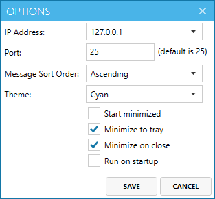
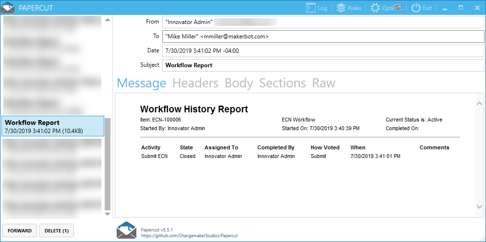

# Workflow Report Email

The Workflow Report Email project adds a Workflow Report Method and an Email template to allow this report to be attached to a server event such as a workflow assignment.


_A sample email generated by the project_

#### How it works
This project adds an email template to run a workflow report method to get the current input item id and the attached workflow and then output the resulting report into an email. It is used by attaching that email template to a workflow activity that will then send the email at the specified trigger. This requires Aras Innovator to be setup to send emails and the *from account* listed on the email template to have a valid email address. 

>Note: The default report settings will only display closed items and will not cycle through subflows. (Example: the above screenshot is sitting at Activity C; if the email were sent from activity A, the email would only display the header with no information.) The report settings can be changed by altering the method code.

## History

Release | Notes
--------|--------
[v1.0.0](https://github.com/ArasLabs/workflow-email-report/releases/tag/v1.0.0) | First release 

#### Supported Aras Versions

Project | Aras
--------|------
[v1.0.0](https://github.com/ArasLabs/workflow-email-report/releases/tag/v1.0.0) | 11.0+, 12.0+ 

## Installation

#### Important!
**Always back up your code tree and database before applying an import package or code tree patch!**

### Pre-requisites

1. Aras Innovator installed
2. Aras Package Import tool
3. Workflow Report Email import package
4. The target Aras instance must have an SMTP server configured. See Testing Options below for testing the project without a full SMTP server configured.
5. Users must have email addresses in the target Aras database. 

### Install Steps

1. Backup your database and store the BAK file in a safe place.
2. Open up the Aras Package Import tool.
3. Enter your login credentials and click **Login**
     * _Note: You must login as root for the package import to succeed!_
4. Enter the package name in the TargetRelease field.
     * Optional: Enter a description in the Description field.
5. Enter the path to your local `..\Workflow-Report-Email\Imports\imports.mf` file in the Manifest File field.
6. Select **aras.labs.WorkflowReportEmail** in the Available for Import field.
7. Select Type = **Merge** and Mode = **Thorough Mode**.
8. Click **Import** in the top left corner.
9. Close the Aras Package Import tool.

You are now ready to login to Aras and configure your workflows with the new email notification.

### Configuring Your Workflow

1. Log in to Aras as admin.
2. Navigate to **Administration > Notification > E-Mail Message**.
3. Open the "Workflow Report Email" template.
4. Set the "From User" property to the Aras User you want to appear as the email sender.
5. Save and close the Email item.
6. Navigate to **Administration > Workflow Maps** and open the Workflow you want to edit.
7. In the Workflow Map editor, select the Activity you want to trigger the email.
8. Select the **Notifications** tab.
9. Click the **Select Items** (12.0+) or **Pick Related** (11.0+) button and choose the "Workflow Report Email" item from the search dialog.
10. In the **Event** column of the relationship grid, select the event you want to trigger the email.
11. In the **Target** column, select who you want to receive the email. 
    * You can find out more about these options by selecting **Help** (12.0+) or **Help > Just Ask Innovator** (11.0+) from the main menu and searching for "email" or "workflow".
13. Repeat steps 7-11 for any other Activities you want to configure with the email notification.
14. Save the Workflow Map.

## Usage

The steps for using this project vary depending on the configuration you chose in the "Configuring Your Workflow" section above. Here's an example where we configured the ECN workflow to send an email when the "ECN Planning" Activity is activated.

1. Create a new ECN.
2. Vote "submit" on the new ECN to advance it from the "Submit ECN" activity to "ECN Planning".
3. Check your email, log folder, or SMTP receiver to confirm the email was sent.
    * This step depends on your SMTP configuration. Check out the "Testing Options" section below for more information on testing your emails in a local/non-production environment.

>Note: It's important to create new items for testing your email configuration. Any changes to your workflow will not affect items that are already in process.

## Testing Options

Don't have an SMTP server configured, or you don't want to spam your users with test emails? Here are two options for testing this project in a dev environment without a full SMTP server.

### 1. Email Debug Option

The `InnovatorServerConfig.xml` file in the root of every Aras Innovator installation contains an operating parameter for email debugging. Enabling this option will write all outgoing emails to files in `Innovator\Server\temp\` by default.

1. Open `InnovatorServerConfig.xml` for editing.
2. Replace `<disabled_operating_parameter key="email_debug_option" value="file"/>` with `<operating_parameter key="email_debug_option" value="file"/>`.
3. Follow the Usage Steps above to trigger an outgoing email.
4. Open up the new file created in `Innovator\Server\temp\`. It should look something like this:

```
TO: test@aras.fake
FROM: "Innovator Admin" <test@aras.fake>
SUBJECT: Workflow Report
<html>
  ... email content ...
</html>
```

To disable email debugging, simply revert the change to the operating parameter.

### 2. Lightweight SMTP Receiver Option

Another option for testing this project without a complete SMTP server is to use a lightweight SMTP Receiver like [Papercut](https://github.com/ChangemakerStudios/Papercut). Here's how:

1. Download and install [the latest release of Papercut](https://github.com/ChangemakerStudios/Papercut/releases).
2. Open the Papercut client and click **Options** in the toolbar.

    

3. Choose an IP address to use and leave the default port. Save your options.
4. Open `InnovatorServerConfig.xml` for editing.
5. Set the IP address you chose in the Mail tag's SMTPServer attribute: `<Mail SMTPServer="127.0.0.1"/>`.
6. Save your changes.
7. Follow the Usage Steps above to trigger an outgoing email. 

The outgoing email should appear in Papercut and look something like this:



## Contributing

1. Fork it!
2. Create your feature branch: `git checkout -b my-new-feature`
3. Commit your changes: `git commit -am 'Add some feature'`
4. Push to the branch: `git push origin my-new-feature`
5. Submit a pull request

For more information on contributing to this project, another Aras Labs project, or any Aras Community project, shoot us an email at araslabs@aras.com.

## Credits

Original Aras community project written by Sam Poe at Aras Corp. @sampoearas

## License

Aras Labs projects are published to Github under the MIT license. See the [LICENSE file](./LICENSE.md) for license rights and limitations.
